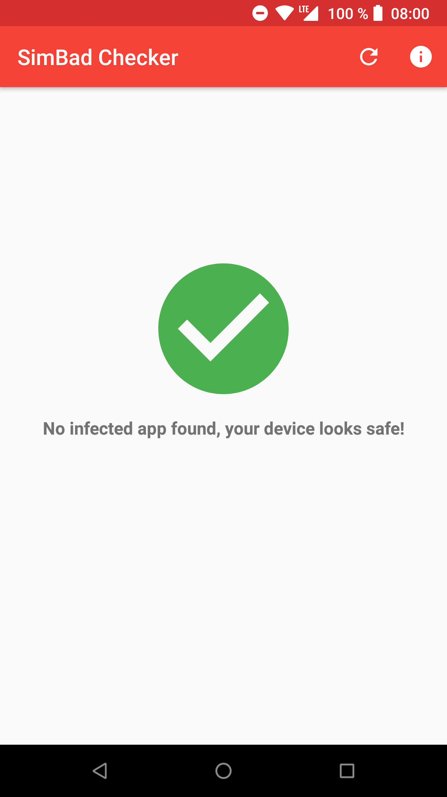
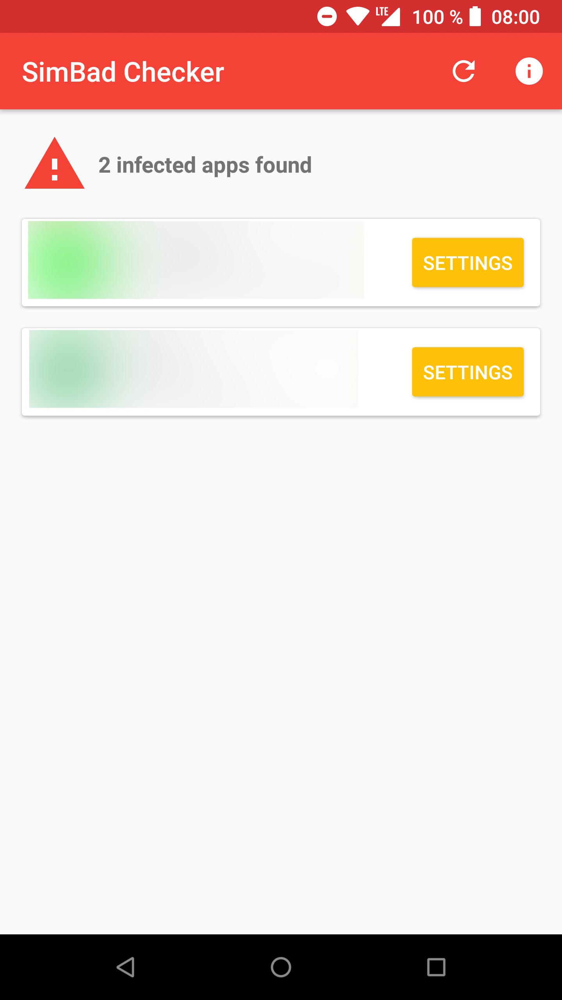

Repository for the SimBad Checker Android app available here : [SimBad Checker](https://play.google.com/store/apps/details?id=com.androdevcafe.simbadchecker)

# What is SimBad

SimBad is an a Rogue Adware discovered by CheckPoint team on 206 Android applications (for more than 150+ millions downloads). Complete details can be found in this [CheckPoint article](https://research.checkpoint.com/simbad-a-rogue-adware-campaign-on-google-play/).

# Why this app ?

This app offer a very quick way to know if you have on your device an infected app installed. As it's a "security" application I think it's important to open source it for more transparency (as everyone can now check the source and build it).

# Screenshots

 

# Donation

If this project helps you with SimBad fighting or for common Android development, please consider giving me a coffee :)

